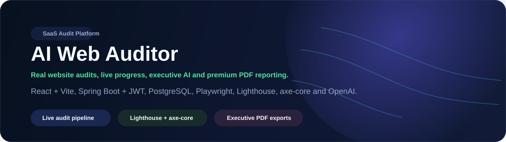
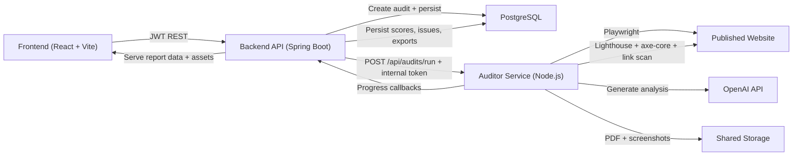
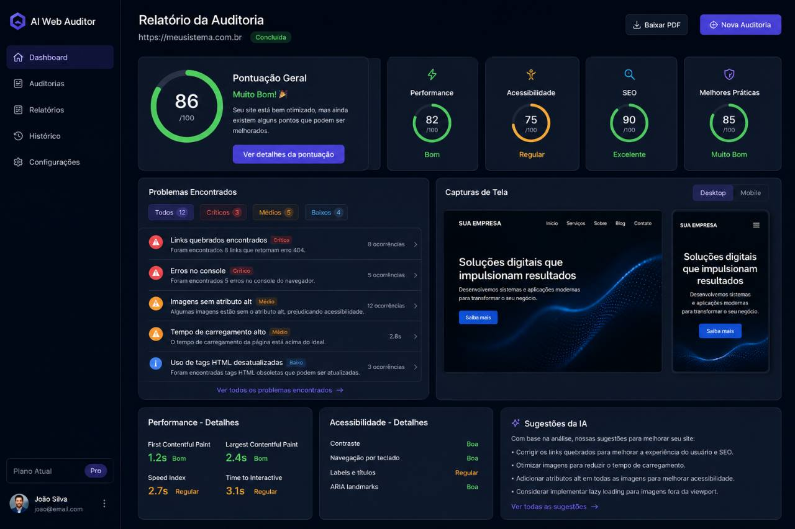

# AI Web Auditor

[](https://react.dev/)
[](https://vite.dev/)
[](https://spring.io/projects/spring-boot)
[](https://openjdk.org/)
[](https://nodejs.org/)
[](https://www.postgresql.org/)
[](https://playwright.dev/)
[](https://developer.chrome.com/docs/lighthouse)
[](./LICENSE)

Professional-grade platform for auditing live websites with real browser automation, Lighthouse, axe-core, executive analysis, historical comparisons, and polished PDF exports.

## Description

AI Web Auditor was designed as a SaaS-style product instead of a static demo. A user submits a public URL, the backend validates and persists the run, the Node.js service executes browser and accessibility checks, and the frontend presents live progress, evidence, recommendations, exports, and history. AI enrichment is optional: the product remains useful with an empty `OPENAI_API_KEY`.

## Features

- JWT authentication with signup, login, and protected routes
- Real published-site audits powered by Playwright
- Lighthouse scoring for Performance, Accessibility, SEO, and Best Practices
- Detailed accessibility findings with `@axe-core/playwright`
- Desktop and mobile screenshots for visual review
- Console errors, network errors, and broken-link detection
- AI-generated executive summary, quick wins, business impact, and technical recommendations
- Real-time progress updates with pipeline stages and user-friendly status messages
- Historical audit tracking with filters and reopening of past reports
- Audit comparison against the previous completed baseline
- Export options for PDF, JSON, and CSV
- Executive dashboard with trend, issue, status, and category charts
- Shared storage strategy for reports and screenshots
- Docker Compose stack with PostgreSQL and service wiring

## Architecture



### Service responsibilities

- `frontend`
  - Authentication UX, dashboard, audit history, live report, settings
  - Charting, loading states, export triggers, responsive SaaS UI
- `backend`
  - JWT auth, persistence, audit orchestration, asset delivery, secure service-to-service communication
  - Dashboard aggregation, comparison baseline, JSON export
- `auditor-service`
  - Browser automation, Lighthouse, accessibility scan, broken-link crawl
  - AI prompt orchestration, executive PDF generation, progress callbacks

## Technologies

### Frontend

- React 18
- Vite 7
- TypeScript
- CSS Modules
- Recharts
- Lucide React

### Backend

- Java 21+
- Spring Boot 3.5
- Spring Security
- JWT
- Spring Data JPA / Hibernate
- PostgreSQL

### Audit engine

- Node.js 24
- Playwright
- Lighthouse
- `@axe-core/playwright`
- Cheerio
- OpenAI API
- PDFKit

## How To Run

### Prerequisites

- Node.js 24+
- npm 10+
- Java 21+
- Maven 3.9+
- Docker Desktop or Docker Engine
- PostgreSQL 16 if you are not using Docker
- Optional: OpenAI API key for generative analysis

### 1. Clone and configure

```bash
git clone <your-repository-url>
cd ai-web-auditor
```

Copy the environment examples:

```bash
copy frontend\.env.example frontend\.env
copy backend\.env.example backend\.env
copy auditor-service\.env.example auditor-service\.env
```

### 2. Run with Docker Compose

```bash
docker compose up --build
```

Services (Docker Compose publishes them on loopback only):

- Frontend: `http://localhost:5175`
- Backend API/health: `http://localhost:8085` / `http://localhost:8085/actuator/health`
- Auditor service: `http://localhost:4000`
- PostgreSQL: internal Compose network (not exposed to the host)

The browser normally talks to `/api` through Nginx; service-to-service traffic uses the private Docker network and separate callback/API tokens.

### 3. Run locally without Docker

Start PostgreSQL first, then launch each module in a separate terminal.

Frontend:

```bash
cd frontend
npm install
npm run dev
```

Backend:

```bash
cd backend
mvn spring-boot:run
```

Auditor service:

```bash
cd auditor-service
npm install
npm run dev
```

## Environment Variables

### Frontend

File: [`frontend/.env.example`](./frontend/.env.example)

```env
VITE_API_BASE_URL=http://localhost:8080/api
```

### Backend

File: [`backend/.env.example`](./backend/.env.example)

```env
SPRING_DATASOURCE_URL=jdbc:postgresql://localhost:5432/ai_web_auditor
SPRING_DATASOURCE_USERNAME=ai_admin
SPRING_DATASOURCE_PASSWORD=substitua-por-uma-senha-forte
APP_JWT_SECRET=change-this-secret-with-at-least-32-characters
APP_JWT_EXPIRATION_MINUTES=1440
APP_AUDITOR_BASE_URL=http://localhost:4000
APP_AUDITOR_API_TOKEN=change-this-auditor-api-token
APP_INTERNAL_CALLBACK_BASE_URL=http://localhost:8080
APP_AUDITOR_CALLBACK_TOKEN=change-this-internal-callback-token
APP_STORAGE_PATH=../storage
APP_FRONTEND_URL=http://localhost:5173
SERVER_PORT=8080
```

### Auditor service

File: [`auditor-service/.env.example`](./auditor-service/.env.example)

```env
PORT=4000
NODE_ENV=development
STORAGE_PATH=../storage
AUDITOR_API_TOKEN=change-this-auditor-api-token
OPENAI_API_KEY=
OPENAI_MODEL=gpt-4.1-mini
AUDITOR_TIMEOUT_MS=120000
```

## Docker

The repository includes:

- Multi-stage Dockerfiles for `frontend`, `backend`, and `auditor-service`
- `.dockerignore` files to keep build contexts lean
- Shared `storage/` volume for screenshots and PDF reports
- Compose healthchecks for PostgreSQL, auditor-service, and frontend
- Internal service tokens for backend-to-auditor and auditor-to-backend communication

Useful commands:

```bash
docker compose up --build
docker compose logs -f backend
docker compose logs -f auditor-service
docker compose down
```

Use `docker compose --env-file .env.example up --build` only for local evaluation. Copy the example values to a private `.env` and replace every placeholder before sharing a deployment.

## Audit lifecycle

Each run is persisted before the worker starts and reports an explicit state throughout its lifecycle:

`Em fila` → `Preparando navegador` → `Analisando desktop` → `Analisando mobile` → `Executando Lighthouse` → `Verificando links` → `Gerando artefatos` → `Concluída`.

Failures and cancellations are terminal states with a friendly message, preserved diagnostic reason, and a safe retry path. Screenshots, JSON, PDF, and findings are independent artifacts; a partial capture failure does not discard the rest of the report.

Important API surfaces include `POST /api/audits`, `GET /api/audits/{id}`, `GET /api/audits/history`, `POST /api/audits/{id}/retry`, `POST /api/audits/{id}/cancel`, and authenticated export/asset endpoints below `/api/audits/{id}`.

## Project Structure

```text
.
|-- frontend
|   |-- src
|   |-- Dockerfile
|   `-- nginx.conf
|-- backend
|   |-- src/main/java/com/aiwebauditor
|   |-- src/main/resources
|   `-- Dockerfile
|-- auditor-service
|   |-- src
|   `-- Dockerfile
|-- docs
|   |-- banner.svg
|   `-- screenshots
|-- storage
|   |-- reports
|   `-- screenshots
|-- docker-compose.yml
`-- README.md
```

## Screenshots

### Audit report dashboard reference



## Production-minded Improvements Already Applied

- Real-time progress callbacks with audit stage tracking
- Historical baseline comparison inside the audit report
- Executive AI section with confidence label, release readiness, quick wins, and business impact
- JSON and CSV exports in addition to PDF
- Frontend route-level code splitting and manual bundle chunking
- Polling reworked to avoid concurrent overlapping requests
- Asset fetch cancellation to reduce memory leaks and stale updates
- Backend security headers and dedicated internal callback endpoint
- Authenticated backend-to-auditor service calls with an internal token
- Container healthchecks, leaner build contexts, and `npm ci`-based Docker builds
- Removal of generated frontend config artifacts from the repository root
- Configurable JPA DDL mode and graceful backend shutdown settings
- Versioned Flyway migrations, including alignment of legacy enum constraints (`V3__align_enum_constraints.sql`)
- Dynamic, PostgreSQL-safe history filtering with pagination and bounded sorting
- SSRF protections for loopback, private, metadata, and non-authorized internal hosts
- Explicit request/asset timeouts and AbortController cancellation in the frontend
- Retry cleanup that clears previous scores, findings, and artifact references before a new attempt

## Validation

The project includes focused integration tests for authentication, ownership isolation, validation, SSRF, artifact confinement, retry cleanup, comparison rules, enum persistence, and error contracts. The auditor-service tests cover runner validation, callbacks, timeout/error normalization, Lighthouse degradation, independent screenshots, and artifact generation. The frontend suite covers the critical report, loading/error, and coverage-formatting flows.

## Known limitations and roadmap

- Add queue-based execution with Redis or RabbitMQ for high-volume workloads
- Add organization workspaces, teams, and role-based access control
- Add scheduled recurring audits and notification workflows
- Add domain-level benchmarking across multiple audit runs
- Add signed public share links for executive reports
- Add retry policies with exponential backoff for remote audit failures
- Store screenshots and reports in S3-compatible object storage
- Add anomaly detection over score trends and release regressions
- Enrich Lighthouse insights with field data and CrUX comparison
- Add branded white-label PDF templates per client account

## License

This project is licensed under the MIT License. See [`LICENSE`](./LICENSE).
